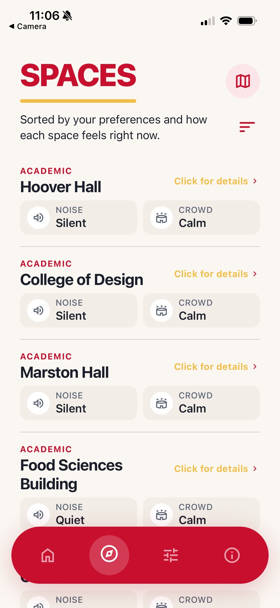
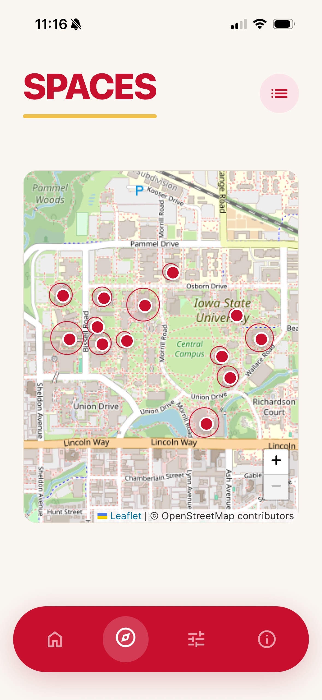
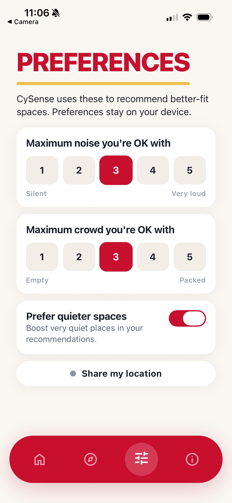

# CySense

CySense is a campus app designed to help students at Iowa State University find spaces that match their comfort level. It provides real-time and historical data on noise, crowd levels, and seating, so students can decide where to study or relax. The app is especially helpful for students who feel overwhelmed in busy environments, but it works for anyone looking for a quieter or more focused space. By using simple, anonymous reports, CySense makes it easier to move around campus in a way that feels more comfortable and manageable.

[](https://www.youtube.com/watch?v=7rcONaQjBvA)
Click the image above to watch the CySense demo on YouTube.

---

## Pictures







---

## Features

- **Live Campus Conditions** - See real time updates on noise levels, crowd density, and seating availability across different campus locations.
- **Interactive Map and List View**  - Explore spaces using a map with highlighted hot zones or switch to a list view to quickly browse and compare locations. If the user gives location access, the map can also show their current location to help them find nearby spaces. Filter by categories like academic buildings, dining, recreation, and outdoor areas.
- **Location Details** - Tap on any location to view detailed information, including current conditions, popular times, recent anonymous reports, and an overall sensory status.
- **Room Availability** - For Parks Library and the Student Innovation Center, CySense pulls room reservation data and adds a rooms section to show which study rooms are booked, which are open, and when booked rooms will become available.
- **Crowdsourced Reports** - Students can submit quick, anonymous reports about their surroundings using simple sliders. These reports help keep data fresh and accurate for everyone.
- **Activity Predictions** - In the activity tab, CySense pulls past user reports from the database and runs a machine learning prediction algorithm to estimate when a place will be empty, busy, quiet, or noisy. The prediction is cached for the day and displayed as a histogram based on real reports submitted by users.
- **Sound Detection** - Users can optionally measure the current noise level using their phone’s microphone. The app only captures an average sound level and does not store any audio.
- **QR Code Integration** - Locations can be linked to QR codes around campus so students can instantly view conditions or submit a report by scanning.
- **Personalized Recommendations** - The home page highlights the best spots based on current conditions and the user’s preferences, making it easier to find a comfortable place quickly.
- **User Preferences** - Customize settings like maximum noise and crowd levels, prioritize quieter spaces, and save preferred locations to tailor recommendations.
- **Historical Trends** - View predicted busy times for each location based on past data, helping students plan ahead and avoid peak hours.
- **Privacy First Design** - No personal tracking, no stored audio, and all reports are anonymous. Data is aggregated to protect user privacy while still being useful.

---

## Future Work
- **Decibel Meters** - If CySense gets funding and university approval, we plan to add decibel meters in busy campus spaces like Parks Library and the SIC. These would only measure sound levels, not record audio, giving the app more accurate real time data while protecting privacy.
- **Expansion** - We would also like to expand CySense beyond Iowa State and bring it to other college campuses across the United States.

---

## Pages

**Home Page** <br>
The home page gives a quick overview of campus conditions. It highlights the best quiet spot at the moment, shows a few recommended locations, and includes basic privacy information so users understand how their data is handled.

**Spaces Page** <br>
This page is the core of the app. It opens with a map that shows campus buildings and highlights how busy or loud each space is based on live backend data. If the user gives location access, the map can also show their current location to help them find nearby spaces.

Users can tap on a building to view current noise, crowd level, popular times, recent anonymous reports, and an option to submit a report. The activity view uses past user reports from the database to run a machine learning prediction algorithm, caches the result for the day, and shows a histogram of when the space is expected to be quiet, noisy, empty, or busy.

There is also a list view option that shows all locations in a simple scrollable format. In this view, users can sort spaces by categories such as academic buildings, recreation centers, dining, and outdoor areas.

When submitting a report, users can adjust sliders for crowd and noise levels. There is also an option to quickly measure sound using the phone’s microphone for a couple of seconds. The app only captures the average noise level and does not store any audio. Once submitted, the report updates the location’s data by combining it with recent reports.

For Parks Library and the Student Innovation Center, the detail view also includes a rooms section. This shows live room availability from their reservation systems, including which rooms are currently booked, which are empty, and when occupied rooms are expected to open up.

**Preferences Page** <br>
This page lets users customize their experience. They can set their preferred maximum noise and crowd levels, choose to prioritize quieter spaces, and select favorite locations. These preferences are used to recommend better spots on the home page. Users can also manage permissions like notifications, location access, and microphone access here.

**About Page** <br>
The about page explains what CySense is, how it works, and how it protects user privacy. It also gives a quick look at future ideas like better predictions, more data sources, and expanded features.

---

## Install

```bash
cd Swan-Hacks
npm install
npm install -g supabase
```

---

## Run locally

```bash
npx expo start
npx expo start --ios
npx expo start --web
```

Out of the box you will see mock ISU data. The Student Innovation Center detail
page also shows mock room openings until the LibCal bridge is deployed.

---

## Tech Stack

Expo React Native with TypeScript for the frontend, Expo Router for navigation, and Supabase for the backend and database. The app is designed to work on both mobile and web using a shared codebase.

---

## Team

**Trice Buchanan**

**Devank Uppal**

**Neal Kaushik Sharma**